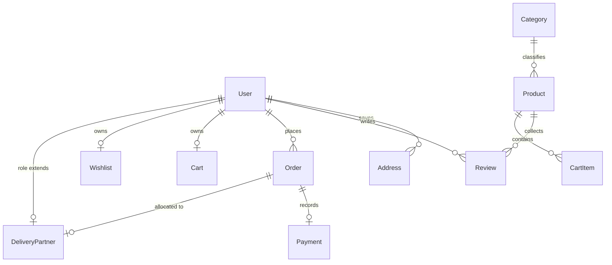

# FreshCart MongoDB Database Documentation

FreshCart uses MongoDB Atlas with the Mongoose ODM framework. This document details the database schema, entity relationships, indexes, and dynamic triggers.

---

## 📊 Entity Relationship Summary

The database uses 12 collections with references:



---

## 🗄 Collections Specifications

### 1. `Users`
Stores account profiles for Customers, Admins, and Delivery Partners.
*   **Key Fields**:
    *   `name`: String (Required, trimmed)
    *   `email`: String (Required, unique, lowercase, regex-validated)
    *   `phone`: String (Required, unique, 10-12 digits)
    *   `password`: String (Required, excluded by default)
    *   `role`: String (Enum: `Customer`, `DeliveryPartner`, `Admin`; Defaults to `Customer`)
    *   `isVerified`: Boolean (Default: `true`)
    *   `resetPasswordToken`: String (Hashed)
    *   `resetPasswordExpire`: Date
*   **Database Hook**:
    *   `pre('save')`: Hashes password string using `bcrypt` (10 salt rounds) only if modified.
*   **Instance Methods**:
    *   `matchPassword(enteredPassword)`: Compares candidate text to stored bcrypt hash.
    *   `getSignedJwtToken()`: Issues a JWT carrying `id` and `role`.

### 2. `Addresses`
Houses shipping address lists for Customers.
*   **Key Fields**:
    *   `userId`: ObjectId (Ref: `User`, Required)
    *   `name`: String (Label e.g., "Home", "Office")
    *   `phone`: String (Contact phone)
    *   `streetAddress`: String
    *   `city`: String
    *   `state`: String
    *   `pincode`: String (6 digits validation)
    *   `country`: String (Default: "India")
    *   `isDefault`: Boolean (Default: `false`)
*   **Database Hook**:
    *   `pre('save')`: If `isDefault` is true, queries all other addresses belonging to the same `userId` and updates them to `isDefault: false` (ensures a single default address).

### 3. `Categories`
Classifies products (e.g., Dairy, Beverages).
*   **Key Fields**:
    *   `name`: String (Required, unique)
    *   `slug`: String (Unique)
    *   `description`: String
    *   `image`: String (Cloudinary URL)
    *   `isActive`: Boolean (Default: `true`)
*   **Database Hook**:
    *   `pre('save')`: Generates an auto-slugified URL slug from category `name` if modified.

### 4. `Products`
Handles grocery items catalog metadata.
*   **Key Fields**:
    *   `name`: String (Required)
    *   `brand`: String
    *   `description`: String
    *   `price`: Number (Required, Min: 0)
    *   `discountPrice`: Number (Default: 0)
    *   `stock`: Number (Required, Min: 0)
    *   `unit`: String (e.g., "500 ml", "1 kg")
    *   `category`: ObjectId (Ref: `Category`, Required)
    *   `isVeg`: Boolean (Required, default: `true`)
    *   `images`: [String] (Array of Cloudinary URLs)
    *   `ratingsAverage`: Number (Default: 4.5, bounds: 1 to 5)
    *   `ratingsQuantity`: Number (Default: 0)
    *   `isActive`: Boolean (Default: `true`)
*   **Indexes**:
    *   **Full-Text Multi-Field Search Index**:
        ```javascript
        ProductSchema.index({ name: 'text', brand: 'text', description: 'text' }, { weights: { name: 10, brand: 5, description: 1 } });
        ```

### 5. `Carts`
Maintains customer shopping items.
*   **Key Fields**:
    *   `userId`: ObjectId (Ref: `User`, Required, Unique)
    *   `items`: Array of embedded objects:
        *   `productId`: ObjectId (Ref: `Product`, Required)
        *   `quantity`: Number (Min: 1, Required)
        *   `price`: Number (Discount or standard price)
    *   `totalQuantity`: Number (Default: 0)
    *   `subtotal`: Number (Default: 0)
*   **Database Hook**:
    *   `pre('save')`: Automatically aggregates `totalQuantity` and `subtotal` from line items prior to writing.

### 6. `Orders`
Holds customer order details.
*   **Key Fields**:
    *   `orderId`: String (Unique, human-readable auto-incremental pattern like `FC-1784822832259`)
    *   `userId`: ObjectId (Ref: `User`, Required)
    *   `items`: Array of embedded objects:
        *   `productId`: ObjectId (Ref: `Product`)
        *   `name`: String
        *   `quantity`: Number
        *   `price`: Number
        *   `subtotal`: Number
    *   `shippingAddress`: Embedded address object
    *   `paymentMethod`: String (Enum: `COD`, `Razorpay`, `Stripe`)
    *   `paymentStatus`: String (Enum: `Pending`, `Completed`, `Failed`, `Refunded`)
    *   `paymentId`: ObjectId (Ref: `Payment`)
    *   `couponCode`: String
    *   `discountAmount`: Number (Default: 0)
    *   `deliveryCharges`: Number (Default: 0)
    *   `taxAmount`: Number (Default: 0)
    *   `totalAmount`: Number (Required)
    *   `orderStatus`: String (Enum: `Received`, `Processing`, `Dispatched`, `Out for Delivery`, `Delivered`, `Cancelled`)
    *   `deliveryPartnerId`: ObjectId (Ref: `User`)
    *   `deliveryOTP`: String (6-digit validation)
    *   `deliveredAt`: Date
*   **Database Hook**:
    *   `pre('save')`: Generates an auto-incremented random Order ID token if not set.

### 7. `Reviews`
Ratings and comments for products.
*   **Key Fields**:
    *   `productId`: ObjectId (Ref: `Product`, Required)
    *   `userId`: ObjectId (Ref: `User`, Required)
    *   `rating`: Number (1 to 5, Required)
    *   `comment`: String (Required)
*   **Triggers (Average Ratings Aggregation)**:
    *   `post('save')` and `post('deleteOne')`: Invokes static helper `calculateAverageRating(productId)` which runs an aggregation pipeline to compute the product's ratings average and rating count, writing results to `Product` document.

### 8. `DeliveryPartners`
Extends User profiles for delivery rider agents.
*   **Key Fields**:
    *   `userId`: ObjectId (Ref: `User`, Required, Unique)
    *   `vehicleType`: String (Enum: `Bicycle`, `Bike`, `ElectricScooter`)
    *   `vehicleNumber`: String
    *   `isAvailable`: Boolean (Default: `true`)
    *   `currentOrderId`: ObjectId (Ref: `Order`)
    *   `location`: Geolocation coordinates object:
        *   `latitude`: Number
        *   `longitude`: Number
        *   `updatedAt`: Date
